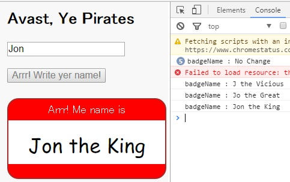

# test-ng2-docheck
###Test Angular2 Dart DoCheck in pirate badge sample.

1. Google original source: in one-hour-codelab  

   * dart-lang/one-hour-codelab/ng2/6-readjsonfile/lib/badge_component.dart  

2. My changed source: in test-ng2-docheck  

    * dankai23/test-ng2-docheck/lib/badge_component.dart  

3. You can change a file and test DoCheck.  

4. snapshot  
    * 
